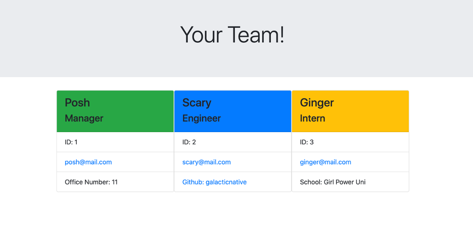

# TeamProfile-generator

    
## Description 
Utilize the command line terminal to initiate a node js application where you can generate an HTML webpage that will display your developer team data. 

## Table of Contents 
* [Installation](#installation)
* [Usage](#usage)
* [Credits](#credits)
* [License](#license)

## Installation 
To use this application, you would need to gitclone the report to your local computer. In the command line terminal, you will install the node.js app and run "npm init", npm inquirer and node Jest.

## Usage 
To begin the app, you would type in the command line terminal "node index.js" or "node index" and then follow the prompts. Once the prompts are finished, you would go to the /dist folder and view the generated HTML file and open the file to view in your default browser. 

## Link to walk-through video demo:
https://drive.google.com/file/d/13LLckAPHA-tA6GR3WDaFsPpmSTu4IcAD/view
    
## Credits 
Starter code provided by the UofA Coding Bootcamp

## License 
Node.js, NPM Inquirer and Jest.

---
🏆 
## Badges

## Contributing 
For contributions, view the issues tab, if any, in the Github repo and follow the directions.

## Tests 
Type "npm run test" to view Jest in action and whether the written tests pass or fail.